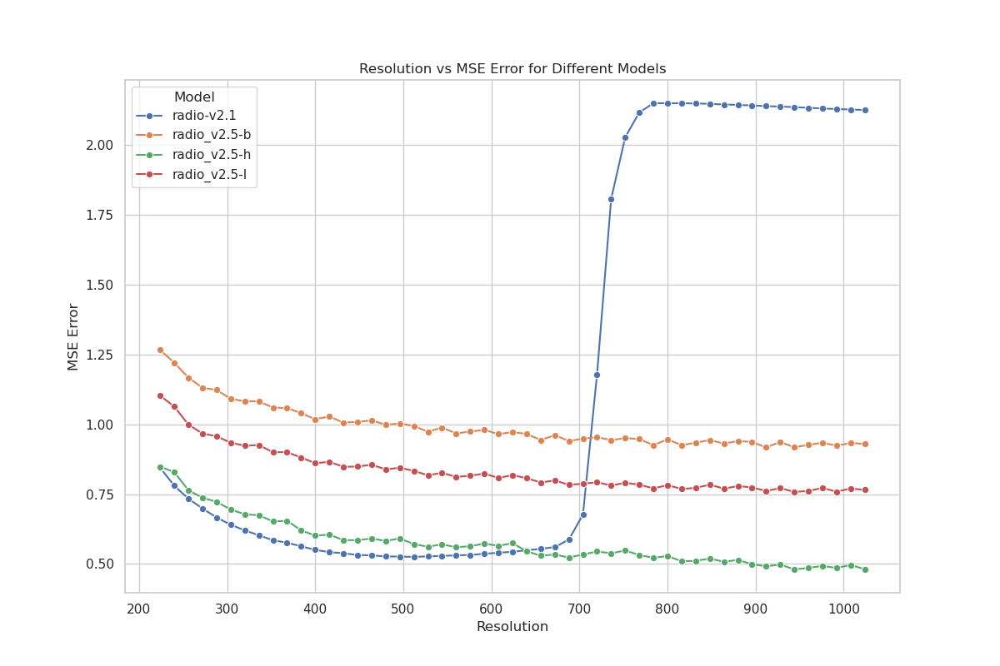
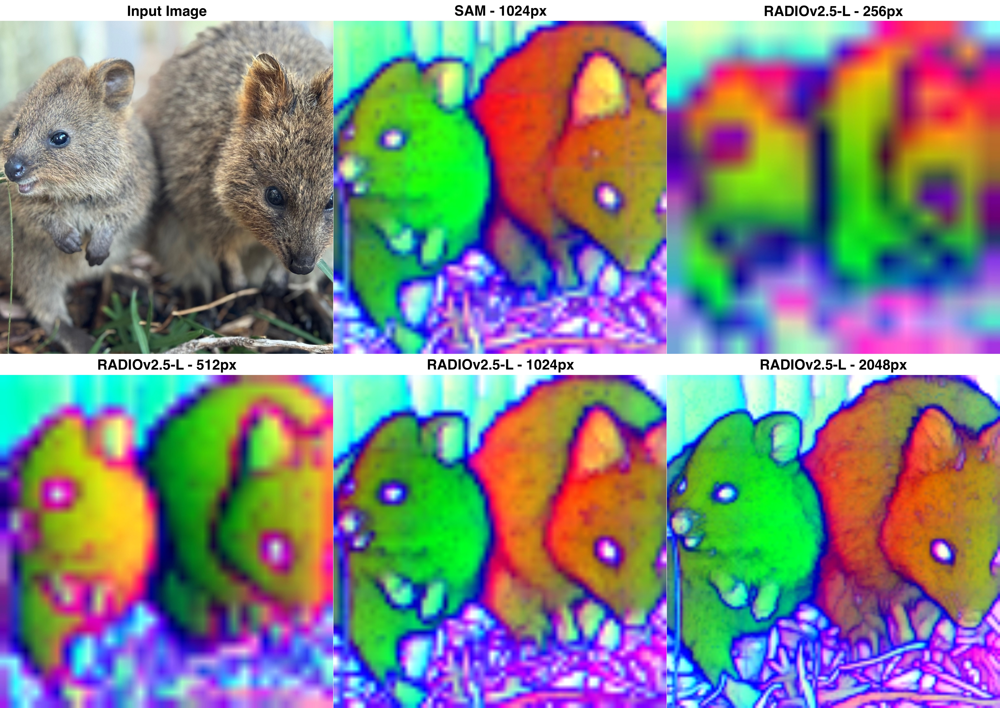

# RADIOv2.5 Tech Report

This is a tech report for the early-access release of the RADIOv2.5 model family. We plan on publishing full papers on the techniques applied for this release in upcoming conferences, but wanted to share the latest models with the community as soon as possible.

On 7.22.24 we are releasing ViT-B/16 and ViT-L/16 pretrained models. Under the hood, we've made a bunch of improvements to the training algorithms to produce these models. Fortunately, the API remains exactly the same!

## What's New?

### Smaller Models

First off, our previous releases have been ViT-H models. While ViT-H is a very powerful model architecture, we've heard from the community that there is a need for smaller VFMs (Visual Foundation Model). With this release, we're releasing ViT-B/16 and ViT-L/16 models which still achieve very strong quality, while being much smaller and faster than ViT-H. In fact, we're so confident in our ViT-L/16 model (RADIOv2.5-L) that we think you should use it instead of RADIOv2.

### Mode Switching

A major issue we identified in the paper is that RADIO was "mode switching" based on the input resolution of the image. In effect, when the resolution was approximately less than 704, it was running in "CLIP + DINOv2" mode where the features were very relevant to those two teachers, but completely irrelevant to SAM. At >720px, RADIO was switching modes to produce features that were relevant for SAM, but suddenly incapable of modeling CLIP or DINOv2.

This would show up in strange ways, for example, trying to do zero shot classification at high resolution would degrade to random guessing (0.1% for ImageNet-1k). It also meant that our results at hi-res when integrated into a VLLM (e.g. LLaVA 1.5 / Vicuna 7B) were similarly poor. Starting with RADIOv2.5, we've solved the mode switching problem, and now these models are truly capable of processing any input resolution without surprising changes in behavior. In fact, RADIOv2.5 _loves_ high resolution, where our best classification and VLLM results are coming from >= 768px resolutions.

    

Similar to the paper, we plot the MSE between the DINOv2-g-reg features and the RADIO model at various resolutions. While RADIOv2 (owing to the ViT-H) is able to achieve at lower MSE at lower resolutions, you can see how at 720px, there's a huge spike in error and never recovers. This is how we quantified the mode switch. We can also visualize this phenomenon:

    
    
    

You can see how the 720px RADIOv2 image abruptly changes representions, whereas DINOv2 and the RADIOv2.5 models remain consistent and instead produce increasingly fine-grained details. We can also see how RADIOv2 is working in reverse with the SAM head, where the low-resolution inputs don't produce features that are SAM-like at all. At 1024px, RADIOv2 starts to produce reasonable SAM features. On the contrary, RADIOv2.5-L produces SAM-like features at any resolution, and arguably does a better job of extrapolating to 2048px resolution.

    
    

Similarly to mode switching being directly observable in the spatial features, it was also causing issues with the summary features, which can be seen looking at zero shot classification:

| Resolution       | RADIOv2.1 | RADIOv2.5-B | RADIOv2.5-L |
|------------------|-----------|-------------|-------------|
| 224              | 78.892    | 62.344      | 74.852      |
| 256              | 80.780    | 68.892      | 78.220      |
| 336              | 82.320    | 72.626      | 80.004      |
| 432              | 82.800    | 73.628      | 80.460      |
| 512              | 82.882    | 73.894      | 80.542      |
| 768              | 1.292     | 74.386      | 80.804      |
| 1024             | 0.204     | 74.280      | 80.886      |

| Resolution       | RADIOv2.1 | RADIOv2.5-B | RADIOv2.5-L |
|------------------|-----------|-------------|-------------|
| 512 - ViTDet 16  | 82.370    | 70.488      | 78.102      |
| 1024 - ViTDet 16 | 0.192     | 72.182      | 79.878      |

Not only do the RADIOv2.5 models allow classification at any resolution, they also allow for using ViTDet mode with only a small drop in accuracy.

There is an important implication to fixing mode switching, which is that it's now possible to ask for both the CLIP and SAM features for a given hi-res image simultaneously, and the results will be meaningful for both. Or, you might want to get the hi-res DINOv2 spatial features as well as the summary token (for classification) for the same image. This wasn't possible with the RADIOv2 model because it wasn't able to simultaneously represent CLIP (or DINO) and SAM at the same time, but is now fixed with the v2.5 models.
