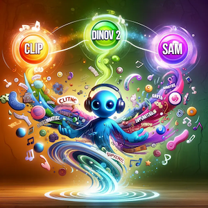
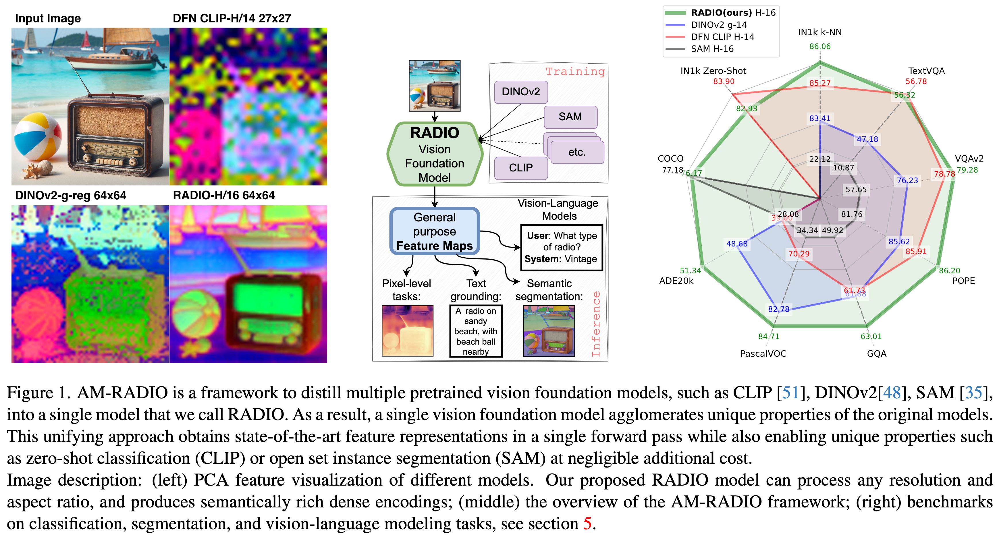

[](https://github.com/NVlabs/RADIO/stargazers)
[](LICENSE)
[](https://arxiv.org/abs/2410.01680)
[](https://arxiv.org/abs/2312.06709)
[](https://openaccess.thecvf.com/content/CVPR2024/papers/Ranzinger_AM-RADIO_Agglomerative_Vision_Foundation_Model_Reduce_All_Domains_Into_One_CVPR_2024_paper.pdf)

# \[CVPR 2024\] AM-RADIO: Agglomerative Vision Foundation Model - Reduce All Domains Into One

<!-- <div align="left"> -->

<!-- </div> -->

Official PyTorch implementation of \[CVPR 2024\] [**AM-RADIO: Agglomerative Vision Foundation Model - Reduce All Domains Into One**](https://arxiv.org/abs/2312.06709).

Check out our latest preprint: [**PHI-S: Distribution Balancing for Label-Free Multi-Teacher Distillation**](https://arxiv.org/abs/2410.01680).


Mike Ranzinger, Greg Heinrich, [Jan Kautz](https://jankautz.com/), [Pavlo Molchanov](https://www.pmolchanov.com/).

[NVIDIA Research](https://www.nvidia.com/en-us/research/)

For business inquiries, please visit our website and submit the form: [NVIDIA Research Licensing](https://www.nvidia.com/en-us/research/inquiries/)

\[[PHI-S](https://arxiv.org/abs/2410.01680)\]\[[AM-RADIO](https://arxiv.org/abs/2312.06709)\]\[[BibTex](#citing-radio)\]

<br clear="left"/>

---


## News/Release
- [10.2.2024] 🔥🔥 RADIOv2.5 ViT-H/16 model is released. We have also released \[[PHI-S: Distribution Balancing for Label-Free Multi-Teacher Distillation](https://arxiv.org/abs/2410.01680)\] to ArXiv that details one of the major algorithm updates behind the version 2.5 releases.
- [7.22.2024] 🔥 RADIOv2.5 ViT-B/16 and ViT-L/16 are released. For VLLM tasks, RADIOv2.5-B is as good or better than RADIOv2, and RADIOv2.5-L is much better! See [tech report](./RADIOv2.5_tech_report.md).
- [4.30.2024] 🔥 README is updated with more metrics, Arxiv is updated with new results.
- [3.21.2024] 🔥 RADIOv2.1 is released. Trained in bf16, improves metrics!
- [2.26.2024]  AM-RADIO paper has been accepted to **CVPR 2024**
- [2.15.2024]  RADIOv2 is released. Trained with DFN CLIP; OpenAI CLIP; DINOv2; SAM teachers. Note that SAM teacher was not used in previous models.
- [1.5.2024] Initial github repo is released.

---

## Abstract


AM-RADIO is a framework to distill Large Vision Foundation models into a single one.
RADIO, a new vision foundation model, excels across visual domains, serving as a superior replacement for vision backbones. Integrating CLIP variants, DINOv2, and SAM through distillation, it preserves unique features like text grounding and segmentation correspondence. Outperforming teachers in ImageNet zero-shot (+6.8%), kNN (+2.39%), and linear probing segmentation (+3.8%) and vision-language models (LLaVa 1.5 up to 1.5%), it scales to any resolution, supports non-square images. We offer an efficient variant, E-RADIO, which achieves is 6-10x faster than CLIP and DINOv2.

<div align="left">
  
</div>

## Quick start and model versions:

The latest model version is RADIOv2. We will update the description once new model is available.

### TorchHub

To load in the TorchHub, use the following command:

```Python
import torch
model_version="radio_v2.5-h" # for RADIOv2.5-H model (ViT-H/16)
# model_version="radio_v2.5-l" # for RADIOv2.5-L model (ViT-L/16)
#model_version="radio_v2.5-b" # for RADIOv2.5-B model (ViT-B/16)
#model_version="e-radio_v2" # for E-RADIO
model = torch.hub.load('NVlabs/RADIO', 'radio_model', version=model_version, progress=True, skip_validation=True)
model.cuda().eval()
x = torch.rand(1, 3, 512, 512, device='cuda')

if "e-radio" in model_version:
    model.model.set_optimal_window_size(x.shape[2:]) #where it expects a tuple of (height, width) of the input image.

# RADIO expects the input to have values between [0, 1]. It will automatically normalize them to have mean 0 std 1.
summary, spatial_features = model(x)

# RADIO also supports running in mixed precision:
with torch.autocast('cuda', dtype=torch.bfloat16):
    summary, spatial_features = model(x)

# If you'd rather pre-normalize the inputs, then you can do this:
conditioner = model.make_preprocessor_external()

# Now, the model won't change the inputs, and it's up to the user to call `cond_x = conditioner(x)` before
# calling `model(cond_x)`. You most likely would do this if you want to move the conditioning into your
# existing data processing pipeline.
with torch.autocast('cuda', dtype=torch.bfloat16):
    cond_x = conditioner(x)
    summary, spatial_features = model(cond_x)
```

For the previous version, use `radio_v1`, `radio_v2`, `radio_v2.1`, or `eradio_v1` for the E-RADIO model.

<details>
<summary> HuggingFace </summary>
### HuggingFace (HF)

```Python
import torch
from PIL import Image
from transformers import AutoModel, CLIPImageProcessor

# hf_repo = "nvidia/E-RADIO" # For E-RADIO.
#hf_repo = "nvidia/RADIO-B" # For RADIO-B.
hf_repo = "nvidia/RADIO-L" # For RADIO-L.
# NOTE: "nvidia/RADIO-H" coming soon!

image_processor = CLIPImageProcessor.from_pretrained(hf_repo)
model = AutoModel.from_pretrained(hf_repo, trust_remote_code=True)
model.eval().cuda()

image = Image.open('./assets/radio.png').convert('RGB')
pixel_values = image_processor(images=image, return_tensors='pt', do_resize=True).pixel_values
pixel_values = pixel_values.cuda()

summary, features = model(pixel_values)
```

</details>

Please see more details on usage in the [Quick Start](#quick-start---torchhub) section. Information on how to load Adapters (teacher specific heads) is also available in the Quick Start section.


| Name         | Architecture | Precision | Teachers                                 | Throughput | Zero Shot Top-1 | kNN Top-1 | ADE20k    | VOC       | GQA       | TextVQA   | VQAv2     | SAM-COCO  |
|--------------|--------------|-----------|------------------------------------------|------------|-----------------|-----------|-----------|-----------|-----------|-----------|-----------|-----------|
| radio_v2.5-h | ViT-H/16-CPE | Float32   | DFN CLIP; SigLIP, DINOv2; SAM; Florence2 | 556        | 82.51           | 85.81     | **51.58** | **85.97** | **65.03** | **62.39** | **81.56** | 76.14     |
| radio_v2.5-l | ViT-L/16-CPE | Float32   | DFN CLIP; SigLIP; DINOv2; SAM            |            | 81.01           | 84.68     | 51.47     | 85.49     | 64.13     | 61.93     | 81.02     | 75.06     |
| radio_v2.5-b | ViT-B/16-CPE | Float32   | DFN CLIP; SigLIP; DINOv2; SAM            |            | 74.57           | 81.89     | 48.94     | 84.35     | 63.31     | 56.93     | 79.22     | 73.87     |
| radio_v2.1   | ViT-H/16-CPE | BFloat16  | DFN CLIP; OpenAI CLIP; DINOv2; SAM       | 556        | **82.93**       | **86.06** | 51.34     | 84.71     | 63.01     | 56.32     | 79.28     | **76.58** |
| radio_v2     | ViT-H/16-CPE | Float32   | DFN CLIP; OpenAI CLIP; DINOv2; SAM       | 556        | 82.71           | 85.92     | 51.33     |           | 62.78     | 56.37     | 79.00     | 76.21     |
| radio_v1     | ViT-H/14-CPE | Float32   | DFN CLIP; OpenAI CLIP; DINOv2            | 556        | 82.73           | 85.29     | 50.32     | 85.17     | 61.43     | 54.92     | 77.88     |           |
| eradio_v1    | E-RADIO      | Float32   | Meta CLIP; DINOv2                        | 3697       | 77.87           | 83.73     | 45.50     | 79.95     | 59.55     | 46.31     | 72.05     |           |


## Results

### Model stats and summarization metrics:

For summarization results we use the summarization token of the model. For Zero-shot we use the corresponding language embedding for most models. For RADIO models we use language embedding from DFN CLIP 378 model.

| Model                  | Params (M) | Resolution | Throughput | ImageNet1K Zero-shot | ImageNet1K k-NN |
|------------------------|------------|------------|------------|---------------------|-----------------|
| OpenCLIP-H/14          | 632        | 224        | 503        | 77.19               | 81.10           |
| MetaCLIP-H/14          | 632        | 224        | 486        | 80.51               | 82.12           |
| SigLIP-L/14            | 428        | 384        | 241        | 82.61               | 85.16           |
| Intern-ViT-6B          | 5,902      | 224        | 63         | 83.20               | 78.43           |
|                        | 5,537      | 448        | 14         |                     | 68.64           |
| DFN CLIP-H/14          | 633        | 378        | 170        | **83.90**           | 85.27           |
| OpenAI CLIP-L/14       | 305        | 336        | 414        | 75.54               | 79.80           |
| DINOv2-g/14-reg        | 1,137      | 224        | 294        | -                   | 83.41           |
| SAM-H/16               | 637        | 1024       | 12         | -                   | 22.12           |
|------------------------|------------|------------|------------|---------------------|-----------------|
| E-RADIO-L              | 391        | 512        | 468        | 80.73               | 83.89           |
| RADIOv2.1              | 653        | 432        | 158        | 82.93               | **86.06**       |
| RADIOv2.5-B            |            | 768        |            | 74.57               |                 |
| RADIOv2.5-L            |            | 1024       |            | 81.01               |                 |
| RADIOv2.5-H            |            | 1024       |            | 82.51               | 85.81           |


### Segmentation metrics:
- Segmentation setup: linear probing, simple head
- For SAM COCO results, we replace the vision backbone of the SAM model with the corresponding RADIO model. The decoder is frozen from the original model.


| Model                  | Segmentation ADE20k | Segmentation VOC | SAM COCO |
|------------------------|---------------------|------------------|----------|
| OpenCLIP-H/14          | 40.04               | 68.03            | -        |
| MetaCLIP-H/14          | 35.39               | 62.62            | -        |
| SigLIP-L/14            | 40.53               | 70.31            | -        |
| Intern-ViT-6B          | 47.20               | 76.85            | -        |
|                        | 42.78               | 74.43            | -        |
| DFN CLIP-H/14          | 39.00               | 70.29            | -        |
| OpenAI CLIP-L/14       | 36.51               | 67.04            | -        |
| DINOv2-g/14-reg        | 48.68               | 82.78            | -        |
| SAM-H/16               | 28.08               | 34.34            | 77.18    |
|------------------------|---------------------|------------------|----------|
| E-RADIO-L              | 48.22               | 81.64            | 76.31    |
| RADIOv2.1              | 51.34               | 84.71            | 76.23    |
| RADIOv2.5-B            | 48.94               | 84.35            | 73.87    |
| RADIOv2.5-L            | 51.47               | 85.49            | 75.06    |
| RADIOv2.5-H            | **51.58**           | **85.97**        | 76.14    |


### Vision-language model performance metrics in LLaVa 1.5:

We replace the vision backbone and keep the same LLM and training recipe as in LLaVa 1.5:

| Model                    | GQA                 | POPE                 | TextVQA                 | VQAv2                 |
|--------------------------|---------------------|----------------------|-------------------------|-----------------------|
| OpenCLIP-H/14            | 57.94               | 83.61                | 50.48                   | 72.24                 |
| MetaCLIP-H/14            | 60.57               | 84.76                | 53.65                   | 75.71                 |
| SigLIP-L/14              | 57.70               | 84.85                | 56.65                   | 71.94                 |
| Intern-ViT-6B-1-2 (224)  | 60.18               | 84.02                | 52.45                   | 76.75                 |
|                   (448)  | 61.19               | 87.23                | 60.36                   | 78.83                 |
| DFN CLIP-H/14            | 61.73               | 85.91                | 56.78                   | 78.78                 |
| OpenAI CLIP-L/14         | 62.20               | 86.09                | 57.92                   | 78.49                 |
| DINOv2-g/14-reg          | 61.88               | 85.62                | 47.18                   | 76.23                 |
| SAM-H/16                 | 49.92               | 81.76                | 43.91                   | 57.65                 |
|--------------------------|---------------------|----------------------|-------------------------|-----------------------|
| E-RADIO-L   (512px)      | 61.70               | 85.07                | 51.47                   | 76.73                 |
| RADIOv2.1   (432px)*     | 63.01               | 86.20                | 56.32                   | 79.28                 |
| RADIOv2.5-B (768px)*     | 63.31               | 87.54                | 56.93                   | 79.22                 |
| RADIOv2.5-L (768px)*     | 64.13               | **87.68**            | 61.93                   | 81.02                 |
| RADIOv2.5-H (768px)*     | **65.03**           | 87.36                | **62.39**               | **81.56**             |

*NOTE: We run RADIOv2.1 in 432px resolution and RADIOv2.5-X in 768px resolution. While this may seem unfair, it's actually because
the mode switching problem in RADIOv2.1 prevents it from achieving strong results at resolutions above 432. Starting with RADIOv2.5,
we have fixed mode switching, which has allowed us to increase the input resolution, resulting in remarkable improvements in metrics
across the board. Details in [tech report](./RADIOv2.5_tech_report.md).

### Probing 3D Awareness

Probing 3D Awareness: we use the code from [Probing the 3D Awareness of Visual Foundation Models](https://github.com/mbanani/probe3d) and
evaluate our RADIO model and its teachers on monocular depth,
surface normals and multi-view correspondance tasks, using the
NAVI dataset. For each task we report the accuracy, averaged
over all thresholds. RADIO preserves features of DINOv2 and
performs much better than CLIP analogs.

| Backbone              | Depth     | Surface Normals | Multi-view corr. |
|-----------------------|-----------|-----------------|------------------|
| DFN CLIP-H/14         | 52.5      | 23.0            | 20.3             |
| OpenAI CLIP-L/14      | 53.7      | 25.3            | 20.7             |
| DINOv2-g/14-reg       | 83.2      | 59.6            | 59.9             |
| SAM-H/16              | 68.2      | 50.3            | 45.3             |
|-----------------------|-----------|-----------------|------------------|
| RADIOv2.1             | 81.0      | 58.5            | **62.1**         |
| RADIOv2.5-B           | 83.0      | 57.5            | 56.1             |
| RADIOv2.5-L           | 84.7      | 60.1            | 58.5             |
| RADIOv2.5-H           | **85.7**  | **62.5**        | 60.9             |


## Detailed usage

```Python
import torch

# If you don't supply the `version` parameter, the latest ViT version will be returned.
model = torch.hub.load('NVlabs/RADIO', 'radio_model', version='radio_v2.5-h', progress=True)
model.cuda().eval()

x = torch.rand(1, 3, 224, 224, device='cuda')

# NOTE: RADIO models expect the input to have values in the range [0, 1]
# NOTE 2: `radio_v1` is a ViT-H/14 model, and supports inputs in the size range `224 < dim < 1008`
#           where each dimension must be divisible by 14.
#           Non-square inputs are supported.
# NOTE 3: `radio_v2` is a ViT-H/16 model, and supports inputs in the size range `224 < dim < 2048`
#           where each dimension must be divisible by 16.
summary, spatial_features = model(x)

# RADIO also supports running in mixed precision, like so:
with torch.cuda.amp.autocast(dtype=torch.bfloat16):
    summary, spatial_features = model(x)
```

### HuggingFace

```python
from PIL import Image
from transformers import AutoModel, CLIPImageProcessor

hf_repo = "nvidia/RADIO" # For RADIO.
# hf_repo = "nvidia/E-RADIO" # For E-RADIO.

image_processor = CLIPImageProcessor.from_pretrained(hf_repo)
model = AutoModel.from_pretrained(hf_repo, trust_remote_code=True)
model.eval().cuda()

image = Image.open('./examples/image1.png').convert('RGB')
pixel_values = image_processor(images=image, return_tensors='pt').pixel_values
pixel_values = pixel_values.to(torch.bfloat16).cuda()

summary, features = model(pixel_values)
```

In order to use adaptors with models from HuggingFace, first you need to load the config
and set `adaptor_names`, then load the model using this config.

```python
config = AutoConfig.from_pretrained(args.hf_repo, trust_remote_code=True)
config.adaptor_names = ["clip", "sam"]
model = AutoModel.from_pretrained(hf_repo, trust_remote_code=True, config=config)
model.eval().cuda()

clip_summary, clip_features = model(pixel_values)["clip"].summary, model(pixel_values)["clip"].features
sam_summary, sam_features = model(pixel_values)["sam"].summary, model(pixel_values)["sam"].features
```

### Usage

RADIO and E-RADIO will return a tuple with two tensors.
The `summary` is similar to the `cls_token` in ViT and is meant to represent the general concept of the entire image.
It has shape $(B,C)$ with $B$ being the batch dimension, and $C$ being some number of channels.
The `spatial_features` represent more localized content which should be suitable for dense tasks such as semantic segmentation, or for integration into an LLM.
RADIO and E-RADIO return spatial features in different shapes:

* RADIO: spatial features have shape $(B,T,D)$ with $T$ being the flattened spatial tokens, and $D$ being the channels for spatial features. Note that $C \neq D$ in general.
* E-RADIO: spatial features have shape $(B,H,W,D)$ with $H$ being the height, and $W$ being the width of the spatial features.

For RADIO, converting to a spatial tensor format can be done using the downsampling size of the model, combined with the input tensor shape. For 'radio_v1', the patch size is 14.
```Python
from einops import rearrange
spatial_features = rearrange(spatial_features, 'b (h w) d -> b d h w', h=x.shape[-2] // patch_size, w=x.shape[-1] // patch_size)
```

The resulting tensor will have shape $(B,D,H,W)$, as is typically seen with computer vision models.

### RADIOv1/v2 Notes

We have trained this model to be flexible in input dimension. It supports arbitrary input sizes. There are useful properties set for the returned model that you may query:
```Python
model.patch_size: int
model.max_resolution: int # (Images can be no larger than this value on either dimension)
model.preferred_resolution: Tuple[height, width] # This is the primary resolution that RADIO was trained at, and will likely
                                                 # produce best results for summary tasks. Dense tasks require experimentation
                                                 # to find the best resolution.
model.window_size: Optional[int] # If `vitdet_window_size` was specified, this is that value
model.min_resolution_step: int # Combines `patch_size` and `window_size` to define what each image dimension must be a multiple of.
                               # e.g. If `patch_size == 16`, then both width and height must be x*16
                               # If `patch_size == 14` and `window_size == 8` then width and height must be x*14*8

# For convenience, you can also call this function to get the nearest valid input size for a given image
nearest_height, nearest_width = model.get_nearest_supported_resolution(height=1024, width=1024)
```

RADIO allows non-square inputs. In fact, both RADIOv1 and RADIOv2 achieve higher zero-shot classification scores when allowing the larger image dimension to vary, and only fixing the smaller dimension.

### Adaptors
_(Currently only supported with TorchHub)_

You may additionally specify model adaptors to achieve extra behaviors. In this mode, radio will return a dict of tuples:

```Python
model = torch.hub.load(..., adaptor_names='clip', ...)

output = model(x)

bb_summary, bb_features = output['backbone']
clip_summary, clip_features = output['clip']
```

Refer to `examples/zero_shot_imagenet.py` for example usage.

#### Supported Adaptors:

- RADIOv2.5: `clip`, `siglip`, `dino_v2`, `sam`
- RADIOv2\[.1\]: `clip`, `dino_v2`, `sam`

The `clip` and `siglip` adaptors have the additional functionality of supporting tokenization and language encoding. Refer to `examples/zero_shot_imagenet.py` for this use, as well as the [API](https://github.com/NVlabs/RADIO/blob/main/radio/open_clip_adaptor.py#L33-L36).

### Preprocessing

By default, RADIO expects the input images to have normalized values in the `[0, 1]` range. If you already have an existing data pipeline, and you'd like conditioning to occur there instead of within the RADIO model, you can call this function:

```Python
preprocessor = model.make_preprocessor_external()

images = preprocessor(images)
...
output = model(images)
```

<details>
<summary>HuggingFace hub</summary>


</details>

<details>
<summary>E-RADIO limitations</summary>

E-RADIO is a more efficient variant of RADIO, but it has some limitations:
- E-RADIO naively supports only images with size divisible by 32. Other resolutions are supported but might result in a performance drop.
- E-RADIO performance is sensative to the window size of the windowed attention in the 3rd and 4th block. For the best performance automatically adjust the window size for the input resolution: `model.model.set_optimal_window_size(IMAGE_SHAPE)`, where `IMAGE_SHAPE` is a tuple of (height, width) of the input image.


</details>

### Intermediate Layer Activations
_(Currently only supported with RADIO)_

Intermediate layer activations can be fetched during inference by using the `forward_intermediates()` method.
Example:

```Python
outputs = model.forward_intermediates(images, indices=[7, 15, 23, 31])
```

## Training

_Coming Soon_

## Star History

<a href="https://star-history.com/#NVlabs/RADIO&Date">
 <picture>
   <source media="(prefers-color-scheme: dark)" srcset="https://api.star-history.com/svg?repos=NVlabs/RADIO&type=Date&theme=dark" />
   <source media="(prefers-color-scheme: light)" srcset="https://api.star-history.com/svg?repos=NVlabs/RADIO&type=Date" />
   
 </picture>
</a>

## Citing RADIO

If you find this repository useful, please consider giving a star and citation:

### PHI-S: Distribution Balancing for Label-Free Multi-Teacher Distillation

#### ArXiv Reference:
```bibtex
@misc{ranzinger2024phisdistributionbalancinglabelfree,
      title={PHI-S: Distribution Balancing for Label-Free Multi-Teacher Distillation},
      author={Mike Ranzinger and Jon Barker and Greg Heinrich and Pavlo Molchanov and Bryan Catanzaro and Andrew Tao},
      year={2024},
      eprint={2410.01680},
      archivePrefix={arXiv},
      primaryClass={cs.LG},
      url={https://arxiv.org/abs/2410.01680},
}
```

### AM-RADIO: Agglomerative Vision Foundation Model - Reduce All Domains Into One

#### CVPR 2024 Reference:
```bibtex
@InProceedings{Ranzinger_2024_CVPR,
    author    = {Ranzinger, Mike and Heinrich, Greg and Kautz, Jan and Molchanov, Pavlo},
    title     = {AM-RADIO: Agglomerative Vision Foundation Model Reduce All Domains Into One},
    booktitle = {Proceedings of the IEEE/CVF Conference on Computer Vision and Pattern Recognition (CVPR)},
    month     = {June},
    year      = {2024},
    pages     = {12490-12500}
}
```

#### ArXiv Reference:
```bibtex
@misc{ranzinger2023amradio,
      title={AM-RADIO: Agglomerative Model -- Reduce All Domains Into One},
      author={Mike Ranzinger and Greg Heinrich and Jan Kautz and Pavlo Molchanov},
      year={2023},
      eprint={2312.06709},
      archivePrefix={arXiv},
      primaryClass={cs.CV}
}
```

## Licenses

Copyright © 2024, NVIDIA Corporation. All rights reserved.

This work is made available under the NVIDIA Source Code License-NC. Click [here](LICENSE) to view a copy of this license.
